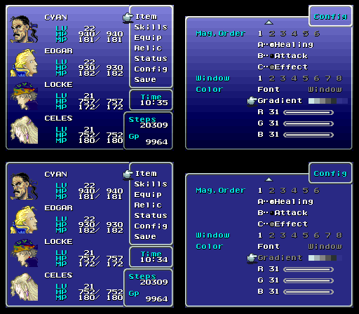
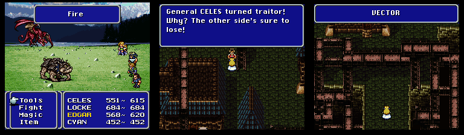
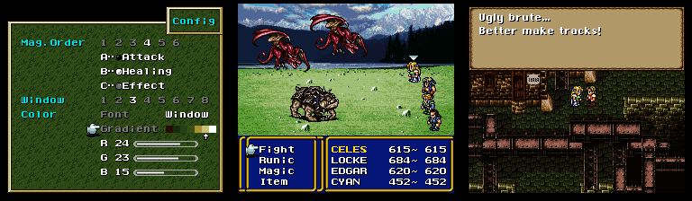

# FF6 Gradient Romhack 1.0

## Description

This hack made in 2017 remove the gradient in Final Fantasy 6 (FF3us). There are two hacks, [no_gradient.asm](asm/no_gradient.asm) that remove the gradient permanently permanently and [menu_gradient.asm](asm/menu_gradient.asm) that implement a menu option to toggle the gradient. `no_gradient.asm` can be assembled with [bass v14](https://www.romhacking.net/utilities/794/) and `menu_gradient.asm` can be assembled with [xkas 0.06](https://www.romhacking.net/utilities/269/). This is a bit weird but working on this hack was during my switch period from the xkas to bass assembler.

## Screenshots

On top the original menu and on bottom the menu without gradient with the menu option you can toggle:

The gradients of the battle screen, dialogues and town names are also affected by both hacks:

Finally, a few examples of custom menu backgrounds that can look good with no gradient:

## ROM to use

You need a FF3us 1.0 ROM. As an example `Final Fantasy III (USA) 1.0.sfc` in the no-intro romset is one. The ROM SHA-1 is `4F37E4274AC3B2EA1BEDB08AA149D8FC5BB676E7`. This hash is from a ROM with no SNES header, if your ROM have one there are tools to remove it.

## Free space

`no_gradient.asm` use no free space. For `menu_gradient.asm`, the free space used is from `$C3F091` to `$C3F13C` and from `$EFFBC8` to `$EFFDF2`. The `$C0F091` code can be relocated elsewhere in same bank and the `$EFFBC8` code can be relocated elsewhere in the ROM if needed. You just need to change the relevant `org` instruction(s) in the asm file.

## Version history

- 1.0 Initial Release 05/23/2017

